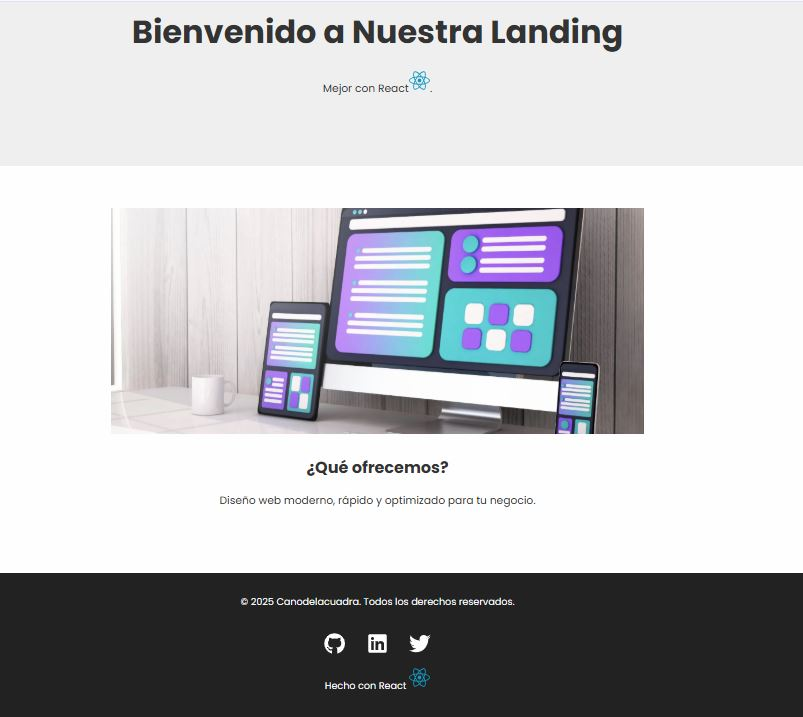
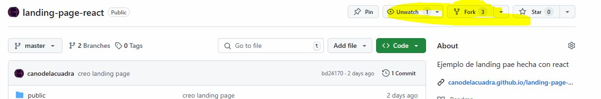

# Landing page en react
Es una simple landing page hecha con react



# Guía instalacion del repositorio en local
1. Hacer un fork y/o clonar la app 



2. Instalamos dependencias de node (no hacemos git init)
```shell
npm install
```

3. Arrancamos el servidor de pruebas
```shell
npm run dev
```

4. hacemos las modificaciones pertienenetes 
5.  hacemos un commit
```shell
git add --all o git add .
git commit -m "nombre del commit"
```
6. Subimos los cambios al repositorio

```shell
git push origin master
```

# Despliegue en netlifly
No es necesario hacer el npm run build
